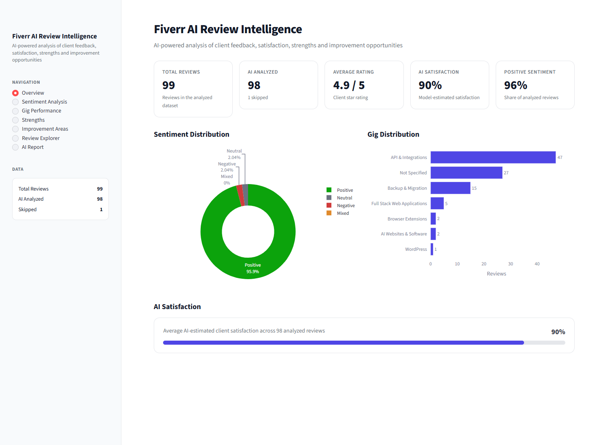

# 📊 Fiverr AI Review Intelligence

**A Generative AI / LLM-powered NLP pipeline that turns raw client reviews into structured business intelligence — with a polished Streamlit analytics dashboard on top.**

This project analyzes real Fiverr client reviews using a **cloud-hosted open-weight LLM (`gpt-oss:20b-cloud` via Ollama Cloud)**, constrained to emit **schema-validated JSON** through Pydantic, then surfaces the results in an interactive SaaS-style dashboard — no spreadsheets, no manual tagging.

> Built as a portfolio project to demonstrate applied **Generative AI, LLM engineering, NLP, and data-product design** end to end: from unstructured text → structured AI judgments → decision-ready analytics.



*Overview page — live KPIs, sentiment distribution, and gig volume, all computed from the AI analysis output. (No client names or emails appear anywhere in the dataset or UI — reviews are keyed by anonymous designation/country only.)*

---

## Why this project

Client reviews are unstructured, inconsistent, and easy to skim past. A freelancer or agency with 100+ reviews scattered across gigs has no fast way to answer:

- What am I actually good at, according to clients?
- Where do clients consistently want more?
- Is sentiment holding up across every service line, or slipping on specific ones?

This project answers those questions by having an **LLM read every review like an analyst would** — extracting sentiment, confidence, satisfaction, strengths, improvement areas, and topics as structured data — and then visualizing the aggregate patterns.

---

## Architecture

```
Fiverr export (CSV)
        │
        │  clean, dedupe, assign review_id
        ▼
Review text  ──────────────►  Ollama Cloud (gpt-oss:20b-cloud)
                                    │
                                    │  Pydantic schema-constrained
                                    │  structured generation
                                    ▼
                          ReviewAnalysis JSON
                    (sentiment, confidence, satisfaction,
                     strengths, improvement_areas, topics,
                     explanation, recommendation)
                                    │
                                    ▼
                    outputs/llm_review_analysis.csv
                                    │
                                    ▼
              ┌─────────────────────────────────────┐
              │   Streamlit Dashboard (this layer)   │
              │   src/  → pandas analytics, no LLM   │
              │   app/  → UI, charts, filters         │
              └─────────────────────────────────────┘
```

**Key design decision:** the dashboard never calls the LLM. AI inference is a one-time, offline batch step (in the notebook); the dashboard is a fast, deterministic analytics layer over its output. This keeps the product cheap to run, demo-able without an API key, and clearly separates *AI judgment* from *AI-agnostic analytics* — the same pattern used in production LLM data pipelines.

---

## The Generative AI / NLP pipeline

| Stage | Detail |
|---|---|
| **Model** | `gpt-oss:20b-cloud`, served via **Ollama Cloud** |
| **Technique** | **Structured generation** — the LLM is constrained to a strict JSON schema derived from a Pydantic model (`ReviewAnalysis.model_json_schema()`), passed as the `format` parameter to `ollama.Client.chat()`. No regex-parsing of free text, no hoping the model returns valid JSON. |
| **Output schema** | `sentiment` (`Positive`/`Neutral`/`Negative`/`Mixed`), `confidence` (0–1), `satisfaction` (0–1), `strengths[]`, `improvement_areas[]`, `topics[]`, `explanation`, `recommendation` |
| **Task type** | Multi-label NLP: sentiment classification + open-vocabulary strength/issue extraction + topic tagging + abstractive summarization, all in a single constrained call per review |
| **Robustness** | Empty/near-empty reviews are detected and explicitly marked `skipped` rather than forced through the model — of 99 reviews, 98 were analyzed and 1 was cleanly skipped |
| **Secrets handling** | `OLLAMA_API_KEY` is read from `.env` (via `python-dotenv`) and never touches source control or the UI |

This pipeline lives in [`notebooks/01_fiverr_review_analysis.ipynb`](notebooks/01_fiverr_review_analysis.ipynb) and is treated as a completed, static artifact — the dashboard layer described below does not modify or re-run it.

---

## The dashboard

A 7-page Streamlit application that turns the AI output into an explorable analytics product:

| Page | What it shows |
|---|---|
| **Overview** | KPI cards (total/analyzed reviews, avg rating, AI satisfaction, positive sentiment %), sentiment donut, gig volume chart |
| **Sentiment Analysis** | Sentiment distribution, sentiment-by-gig stacked bars, AI confidence, live filters (sentiment / gig / rating / satisfaction range) |
| **Gig Performance** | Objective, unranked metrics per gig (no "best/worst" labeling) — review count, avg rating, AI satisfaction, positive sentiment %, AI confidence — plus per-gig expandable strength/improvement breakdowns |
| **Strengths** | Aggregated, searchable table of AI-extracted client-praised strengths with frequency & % of reviews, filterable by gig/sentiment |
| **Improvement Areas** | Aggregated improvement areas + a gig × improvement-area heatmap. Reviews with no flagged issues are correctly treated as *no signal*, not a negative one |
| **Review Explorer** | Full filterable review table (gig, sentiment, rating, min. satisfaction, country) with a per-review AI analysis drill-down: sentiment, confidence, satisfaction, strength/topic/improvement badges, explanation, recommendation |
| **AI Report** | A deterministic, Pandas-computed executive summary — strengths, improvement opportunities, gig insights, common topics, and factual, data-grounded key observations. **No LLM calls happen on this page** |

Design notes:
- Clean SaaS-style layout: KPI cards, sectioned charts, badges, empty states, sidebar navigation with live data counts.
- Sentiment color semantics (green/gray/red/orange) are consistent across every page.
- Every chart is built with Plotly (`plotly_white` template) with hover tooltips and legends — nothing is a static image.
- All numbers are computed live from the CSVs with pandas. **Nothing is hardcoded or invented.**

---

## Sample results (from the author's private dataset)

*(Real output from the 99-review dataset used to build this project — not illustrative placeholders. This dataset is not included in the repo; see [Data & privacy](#data--privacy) below.)*

| Metric | Value |
|---|---|
| Total reviews | 99 |
| AI-analyzed | 98 (1 skipped — empty review text) |
| Average client rating | 4.9 / 5 |
| Average AI-estimated satisfaction | 90% |
| Average AI confidence | 93% |
| Positive sentiment | 96% (94 positive · 2 neutral · 2 negative) |
| Top topic | Technical Quality (mentioned in 51% of reviews) |
| Largest gig by volume | API & Integrations (47 reviews) |

---

## Tech stack

- **LLM / GenAI:** Ollama Cloud, `gpt-oss:20b-cloud`, structured/schema-constrained generation
- **Data validation:** Pydantic v2
- **Data processing:** Pandas, NumPy
- **Dashboard:** Streamlit
- **Visualization:** Plotly (interactive), Matplotlib (exploratory, in-notebook)
- **Language:** Python 3.12

---

## Project structure

```
fiverr-review-analyze/
│
├── data/
│   ├── raw/
│   │   ├── fiverr_reviews.csv          # ← YOUR real export goes here (gitignored, not in repo)
│   │   └── sample_fiverr_reviews.csv   # Synthetic demo data, ships with the repo
│   └── processed/
│
├── notebooks/
│   └── 01_fiverr_review_analysis.ipynb # LLM analysis pipeline (Ollama + Pydantic)
│
├── outputs/
│   ├── llm_review_analysis.csv         # ← YOUR real AI results (gitignored, not in repo)
│   ├── sample_llm_review_analysis.csv  # Synthetic demo AI output, ships with the repo
│   ├── charts/
│   └── reports/
│
├── src/                                # Pure Python — no Streamlit, fully unit-testable
│   ├── data_loader.py                  # load_reviews · load_ai_results · merge_data
│   ├── analytics.py                    # sentiment/gig/strengths/improvement/topic analytics
│   └── utils.py                        # safe JSON-list parsing, formatting helpers
│
├── app/                                # UI layer only
│   ├── app.py                          # entry point, routing, sidebar
│   ├── styles.py                       # design tokens & CSS
│   ├── components.py                   # KPI cards, badges, sentiment pills
│   └── views/                          # one module per dashboard page
│
├── docs/screenshots/                   # README images
└── requirements.txt
```

---

## Getting started

```bash
# 1. Create/activate the virtual environment
python -m venv venv
venv\Scripts\activate          # Windows
source venv/bin/activate       # macOS/Linux

# 2. Install dependencies
pip install -r requirements.txt

# 3. Launch the dashboard
streamlit run app/app.py
```

That's it — no data setup required. The dashboard ships with a small **synthetic sample dataset** (`data/raw/sample_fiverr_reviews.csv` + `outputs/sample_llm_review_analysis.csv`) and automatically falls back to it whenever your own data isn't present, so it's fully working immediately after cloning. You'll see a banner in the app whenever sample data is being used.

It **does not call Ollama or require an API key to run** — it only reads the two CSVs above (or your own, below) and computes everything with pandas.

---

## Data & privacy

The real review dataset used to build this project (99 reviews) is **intentionally excluded from this repository** — `data/raw/*` and `outputs/*` are gitignored so no client feedback data is ever committed. Only the synthetic sample files described above are tracked in git.

### Using your own data

```bash
# 1. Create the folder if it doesn't already exist
mkdir -p data/raw

# 2. Drop your Fiverr review export here — this exact path is gitignored,
#    so it will stay local and never get committed
#    → data/raw/fiverr_reviews.csv

# 3. Run notebooks/01_fiverr_review_analysis.ipynb to produce
#    → outputs/llm_review_analysis.csv
#    (requires OLLAMA_API_KEY in a local .env file — see .env.example-style
#    usage in the notebook; never commit this key)

# 4. Restart the dashboard - it automatically prefers your real data
#    over the bundled sample the moment both files exist
streamlit run app/app.py
```

Expected raw CSV columns: `#, DESIGNATION, COUNTRY, STARS, DURATION, AGE, REVIEW, GIG, SCREENSHOTS` (see `src/data_loader.py` for exact parsing/cleaning rules — it also tolerates a stray pivot table or blank rows tacked onto the sheet, which is what real-world exports tend to look like).

---

## What this project demonstrates

- **Applied Generative AI:** using an LLM as a structured-extraction engine (schema-constrained JSON generation) rather than free-text chat — the production-grade pattern for GenAI data pipelines.
- **NLP task design:** sentiment classification, open-vocabulary entity/phrase extraction, topic tagging, and abstractive summarization framed as one composite task per document.
- **Data engineering discipline:** defensive parsing of a real, messy CSV export (stray pivot tables, blank rows, malformed JSON) without ever crashing the app.
- **Product thinking:** separating a one-time, costly AI step from a fast, free, always-available analytics layer — and being explicit about what's AI-derived vs. deterministically computed.
- **Full-stack data product delivery:** from a Jupyter notebook experiment to a navigable, filterable, portfolio-ready dashboard.

---

## License

This is a personal portfolio project. Feel free to explore the code and adapt the patterns for your own review/feedback-analysis use cases.
